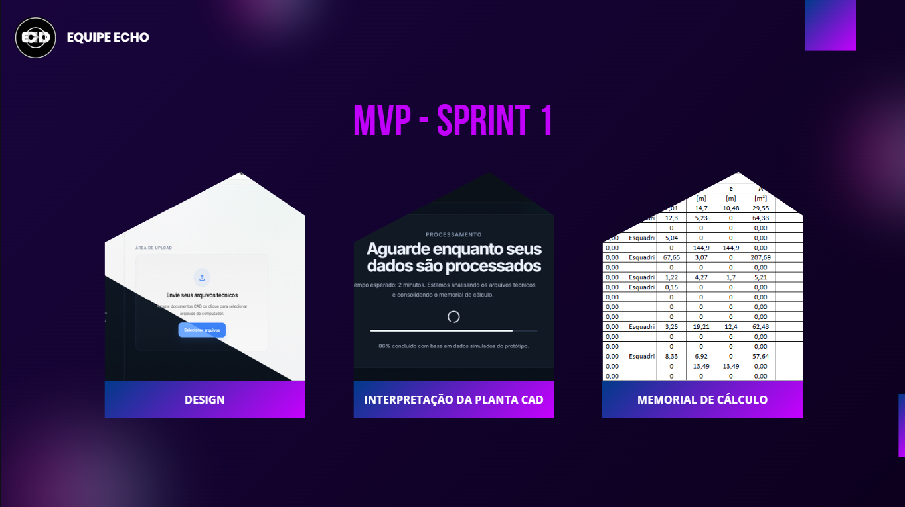

# Equipe Echo

## 📌 EchoCAD – Automatização de documentos técnicos

Sistema desenvolvido como parte do projeto do 4º Semestre da **API – Aprendizagem por Projetos Integrados (FATEC – 2026-1º Semestre)**, em parceria com o **Exército - Guarnição de Caçapava**.

O objetivo é desenvolver um site para extrair informações de uma planta CAD e gerar automaticamente uma documentação técnica utilizando inteligência artificial para auxiliar nas etapas necessárias para criação desse documento.

---

## 📖 Sumário

- [Sobre o Projeto](#about)
- [Objetivo do Desafio](#objective)
- [Manuais e Documentação](#documents)
- [Backlog do Produto](#backlog)
- [Cronograma de Sprints](#sprint)
- [Funcionalidades](#functionalities)
- [Requisitos não Funcionais](#requirements)
- [Tecnologias Utilizadas](#tecnologies)
- [Autores](#authors)

---

## 📌 Sobre o Projeto

Este projeto visa criar uma solução capaz de retirar dados de uma planta CAD com precisão, interpretá-los e fornecer ao usuário informações diretas e precisas. Com isso é possivel agilizar a criação de um memorial de cálculo.

---

## 🎯 Objetivo do Desafio

- Dado um modelo de uma planta CAD inserido pelo usuário, absorver dados relevantes para gerar uma documentação
- Realizar cálculos complexos juntamente com uma IA para verificar a veracidade dos resultados
- Retornar ao consumidor um documento que segue as normas ABNT com informações pertinentes e uma planilha com os gastos necessários
- Desenvolver uma interface direta para que não haja confusão ao navegar pelo site

---

## 📚 Manuais e Documentação

- 📖 [Manual de Instalação](docs/manual-instalacao.md)  
- 👨‍💻 [Manual do Usuário](docs/Manual%20do%20Usuário%20-%20EchoCAD.pdf)

---

# 📋 Backlog do Produto

| Rank | Prioridade | User Story | Estimativa | Sprint |
|-----|------------|------------|------------|--------|
| US01 | Altíssima | Como engenheiro, quero enviar um arquivo CAD para que o sistema processe a planta automaticamente. | 5 | 1 |
| US02 | Altíssima | Como engenheiro, quero exportar o memorial de cálculo em planilha Excel e salvar os dados do memorial no sistema, para facilitar a análise, documentação e armazenamento das informações do projeto | 8 | 1 |
| US03 | Alta | Como engenheiro, preciso que o sistema valide o formato dos arquivos CAD enviados para garantir que apenas arquivos CAD sejam processados. | 3 | 1 |
| US04 | Alta | Como engenheiro, quero que o sistema aplique fórmulas  de engenharia para gerar dados do memorial de cálculo. | 8 | 1 |
| US05 | Alta | Como engenheiro, quero gerar automaticamente um memorial de cálculo estruturado para documentar o projeto técnico. | 5 | 1 |
| US06 | Alta | Como engenheiro, quero uma interface limpa e direta para que eu não fique perdido ao tentar navegar pelo site. | 5 | 1 |
| US07 | Alta | Como engenheiro, quero uma IA dedicada para filtrar os dados extraídos da planta CAD corretamente de acordo com as layers. | 8 | 1 |
| US08 | Alta | Como engenheiro, quero ter uma tela de login e cadastro para acessar minhas análises anteriores. | 5 | 3 |
| US09 | Alta | Como engenheiro, quero preencher um formulário com as informações do projeto e do levantamento de campo para melhor precisão e efetividade na geração dos documentos.  | 8 | 3 |
| US10 | Alta | Como engenheiro, quero gerar automaticamente especificações técnicas do projeto. | 5 | 3 |
| US11 | Alta | Como engenheiro, quero que as especificações técnicas sejam geradas com base nas normas NBR. |5 | 3 |
| US12 | Média | Como engenheiro, quero visualizar um dashboard com meus projetos e documentos gerados para acompanhar o progresso das análises. | 3 | 3 |
| US13 | Média | Como engenheiro, quero exportar especificações técnicas em DOCX. | 3 | 3 |
| US14 | Média |  Como engenheiro, quero acessar um histórico de documentos gerados para consultar análises anteriores. | 3 | 3 |
| US15 | Baixa | Como engenheiro, quero acessar um manual de uso do sistema. | 2 | 3 |
| US16 | Baixa | Como engenheiro, quero um manual de instalação da aplicação para facilitar a implantação. | 2 | 3 |

---
## 🚀 MVP - Mínimo Produto Viável

### 🟢 Sprint 1 - Geração do memorial de cálculo básico - Concluído - <a href="./docs/backlog_sprint1/backlog.md"> Detalhes</a>

### 🟡 Sprint 2 - Assitente IA e geração de especificações técnicas  - Não Concluído - <a href="./docs/backlog_sprint2/backlog.md"> Detalhes </a>

### 🔵 Sprint 3 - Documentação e exportação de documentos - Concluído - <a href="./docs/backlog_sprint3/backlog.md"> Detalhes </a>

#### Assista o vídeo de apresentação da Sprint

## 🏃‍ DoR - Definition of Ready

- Regras de negócio definidas juntamente com o cliente
- Problema proposto compreendido e discutido com a equipe
- User Stories com Critérios de Aceitação
- Subtarefas divididas a partir das US
- Projeto bem definido e acordado com o cliente
- Arquitetura MVC clara para toda a equipe

## 🏆 DoD - Definition of Done

- Manual do projeto
- Vídeos de cada etapa de entrega
- Documentação informando a funcionalidade implementada
- Descrição de commits que seguem o padrão

## 📅 Cronograma de Sprints 

| Sprint          |    Período    |
| --------------- | :-----------: |
| 🔖 **SPRINT 1** | 16/03 - 05/04 |
| 🔖 **SPRINT 2** | 13/04 - 03/05 |
| 🔖 **SPRINT 3** | 11/05 - 31/05 |

---

## ⚙️ Funcionalidades

- Extração de dados através da planta CAD
- Filtro das layers da planta utilizando IA
- Cálculos complexos para tratação de dados
- Consultas de preços dos materiais utilizados
- Entrega de resultados em PDF e XLSX

---

## 🔧 Requisitos Não Funcionais

- Manual de instalação (no repositório).  
- Manual do usuário

---

## 💻 Tecnologias

<h4 align="center">
 
 
 
 
 
 
 
 
 
 
</h4>

---

## 👥 Autores

Projeto desenvolvido pelos alunos do **4º semestre de ADS – FATEC SJC (2026-1)** em parceria com o **Exército - Guarnição de Caçapava**.  

  <table>
    <tr>
      <th>Membro</th>
      <th>Função</th>
      <th>Github</th>
      <th>Linkedin</th>
    </tr>
    <tr>
      <td>Rafael Barbosa Candido</td>
      <td>Product Owner</td>
      <td></td>
      <td></td>
    </tr>
    <tr>
      <td>Fábio Hiromitsu Nawa</td>
      <td>Scrum Master</td>
      <td></td>
      <td></td>
    </tr>
    <tr>
      <td>Gustavo Felipe Morais</td>
      <td>Desenvolvedor</td>
      <td></td>
      <td></td>
    </tr>
    <tr>
      <td>Luiz Roberto Briz Quirino</td>
      <td>Desenvolvedor</td>
      <td></td>
      <td></td>
    </tr>
    <tr>
      <td>Nicolas Ferreira Fernandes</td>
      <td>Desenvolvedor</td>
      <td></td>
      <td></td>
    </tr>
    <tr>
      <td>Ryan Araújo dos Santos</td>
      <td>Desenvolvedor</td>
      <td></td>
      <td></td>
    </tr>
    <tr>
      <td>Taylor Henrique Marinho Silva</td>
      <td>Desenvolvedor</td>
      <td></td>
      <td></td>
    </tr>
    <tr>
      <td>Wesley Xavier</td>
      <td>Desenvolvedor</td>
      <td></td>
      <td></td>
    </tr>
  </table>

